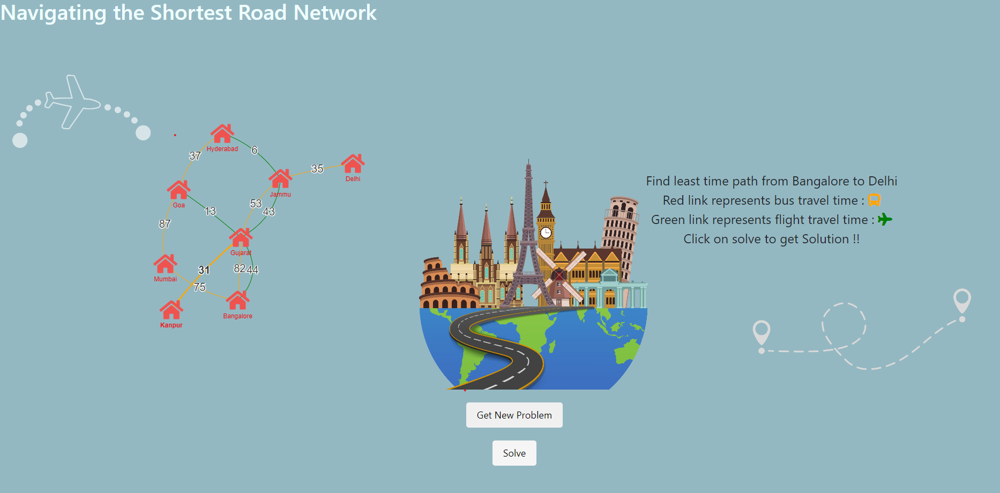
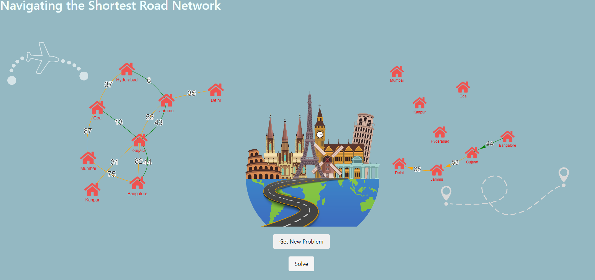

# ShiftPath - least time-efficient bidirectional

## Overview

**ShiftPath** is a web-based application designed to help users find the fastest and most cost-effective route from their source location to their destination along with path, considering both bus and plane transportation. The unique constraint in this application is that the plane can be used only once throughout the entire journey. The project is inspired by Google Maps' optimization of travel time and cost, and it utilizes Dijkstra's algorithm to find the optimal path. The application is built using HTML, CSS, and JavaScript, with the vis.js library for data visualization.

## Features

- **Dynamic Problem Generation**: ShiftPath allows users to generate new travel problems dynamically, creating unique scenarios for route optimization.

- **Optimization Algorithm**: The application uses Dijkstra's algorithm to find the least time-efficient path from the source to the destination while considering both bus and plane travel options.

- **Plane Constraint**: Users can specify a constraint that allows them to use the plane only once during their journey, adding a challenging dimension to route planning.

- **Interactive Visualization**: vis.js library is used to create interactive visualizations of the generated travel scenarios, making it easy for users to understand and compare different routes.

- **Responsive Design**: The user interface is designed to be responsive and user-friendly, ensuring that it works seamlessly on both desktop and mobile devices.

## Output Image

*Description: - Click "Generate New Problem" to create a new travel scenario..*

 *Description:  - After generating a new problem, click "Solve" to find the best solution.*

## Installation

No installation is required to use ShiftPath, as it is a web-based application. Simply access it through your web browser.

## FOR MORE INFO 
**if the graph was unidirectional instead of bidirectional would code still work ? yes! but with modification plane edge selection required!**
*is there path btw src and dest not exit in case the graph has more than one connected components ? yes*
*complexity of dijkstra and plane edge selection is N^2,E*
*GRAPH REPRESENTATION USED HERE IS ADJACENCY LIST*

